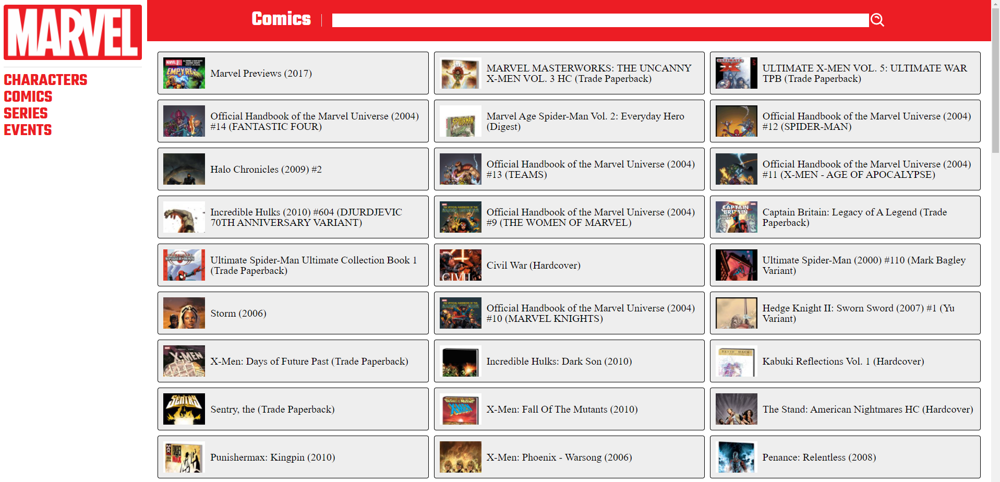
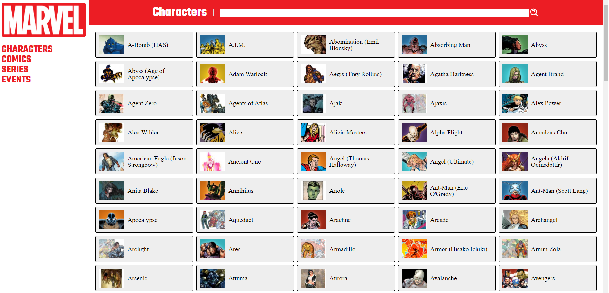
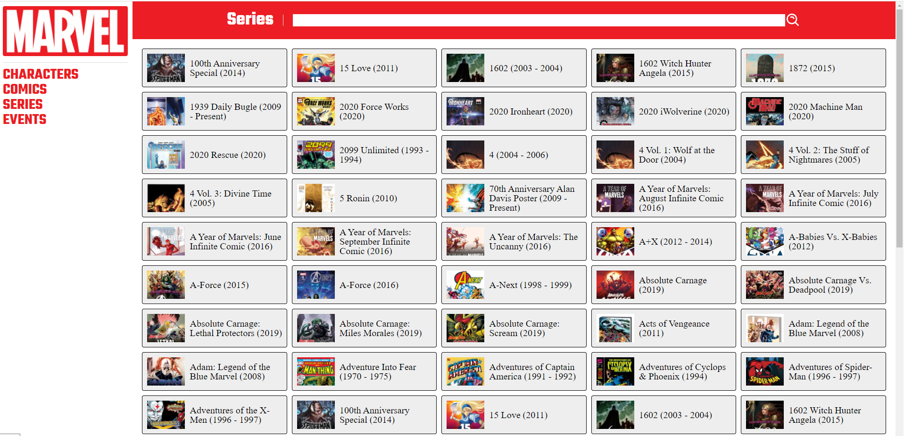

# 
<h1 align="center">Atividade 2 - React</h1>

## Descrição do Projeto

Projeto desenvolvido para praticar conceitos basicos do react.
Consumindo uma API, estilizando e renderizando.

## Como executar?

Após clonar o projeto é necessario realizar configurações utilize o .env.example e renomeie para .env

Acesse [Api Marvel Documentação](https://developer.marvel.com/documentation/authorization) realize o acesso e utilize a chave privada e publica fornecida e depois gere um HASH no formato md5

## Comando para executar

```
npm start
```

# Detalhes do Projeto


## [Styled Components](https://styled-components.com/)

* Foram realizados componentes de estilos utilizando a biblioteca styled Components, qual permite realizar esse processo de estilo ao nivel de componente na aplicação.

## [Axios](https://axios-http.com/docs/intro)


* Utilizado a biblioteca Axios, qual é um cliente HTTP, baseado em promises para realizar requisições.

## [Search]()

* Para realizar pesquisa foi implementado a busca por letra, ou seja a cada letra digitada no input é realizada a requisição e renderizada.

## [Infinity scroll]()

* Implementado o scroll infinito, ou seja ao chegar no fim da pagina é realizada uma nova requisição.

<h1 align="center">
  
</h1>


## Demonstração do Projeto

<h1 align="center">
  
</h1>
<h1 align="center">
  
</h1>
<h1 align="center">
  
</h1>


